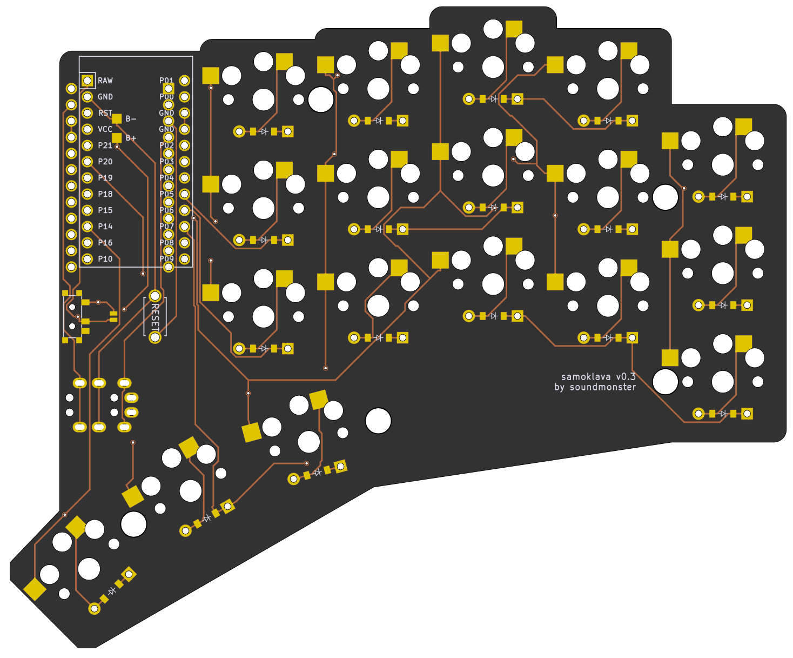
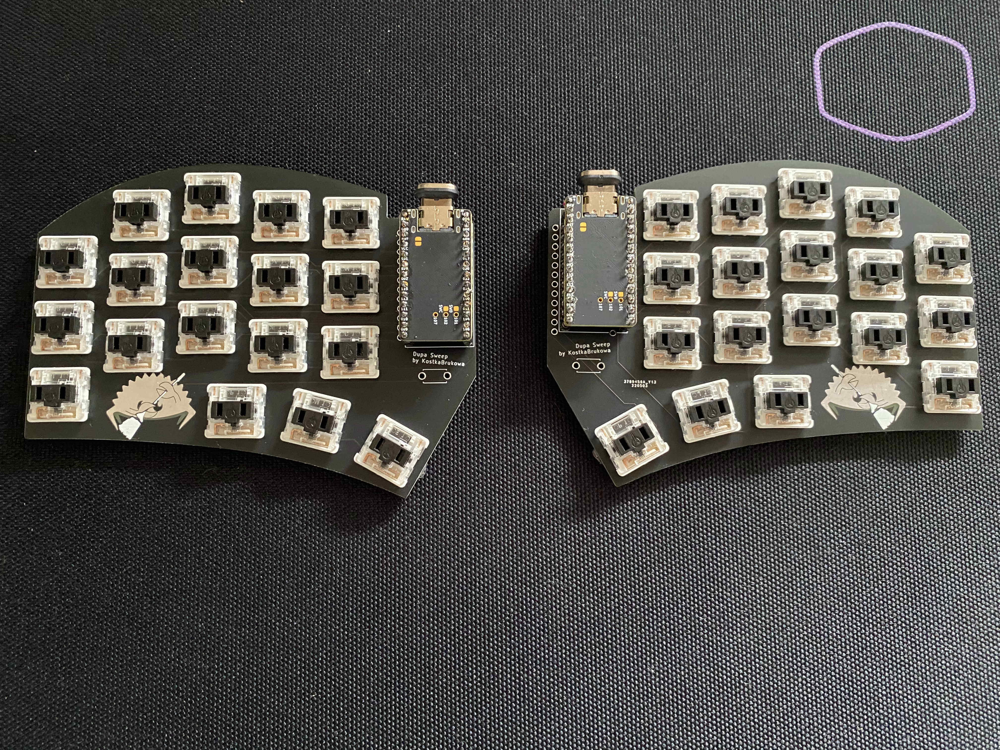

# DupaSweep
## An autogenerated split 36 key [Sweep](https://github.com/davidphilipbarr/Sweep) clone based on [ samoklava ](https://github.com/soundmonster/samoklava)

left | right
-|-
 | 

Without keycaps:

This keyboard was generated using [Ergogen](https://github.com/ergogen/ergogen).
If you want to make some changes look in above repository for details.

A 5x3 split keyboard with 3 thumb keys. There is nothing unique about the keyboard layout. It's practically choc mini Sweep keyboard with
extra key and no TRRS. I've removed TRRS to support diode-less build for wireless option.

Top outlines matches Exactly the original sweep outlines, bottom outlines are adjusted to the extra key.

I also provide [ZMK config](zmk-config) for this keyboard with my own keymap.

Gerber files are available in [this directory](./gerbers). I've successfully managed to order it on
[JLPCB](https://jlcpcb.com/) website, and it works well.

See the [workflow](.github/workflows/build.yml) or the [Makefile](ergogen/Makefile) for more details.

## Run locally:

`docker images`
`❯ docker run -v $(pwd)/output:/output c8ab98c1df67 python /usr/lib/python2.7/dist-packages/kicad-automation/pcbnew_automation/export_dsn.py /output/pcbs/board.kicad_pcb /output/pcbs/board.dsn`
`❯ docker run -v $(pwd)/output:/output f4c89f58fd11 java -jar /opt/freerouting_cli.jar -de /output/pcbs/board.dsn -do /output/pcbs/board.ses`
`❯ docker run -v $(pwd)/output:/output c8ab98c1df67 /usr/lib/python2.7/dist-packages/kicad-automation/pcbnew_automation/import_ses.py /output/pcbs/board.kicad_pcb /output/pcbs/board.ses`
`❯ docker run -v $(pwd)/output:/output sha256:8a361e9808f9ae25d86478e5110e61046024c97a23c6e60b45989cfe6ce3e040 kikit fab jlcpcb --no-assembly /output/pcbs/board.kicad_pcb /output/gerbers/board`

case:
`npx @jscad/cli@1 output/cases/bottom.jscad -of stla -o bottom.stl `
